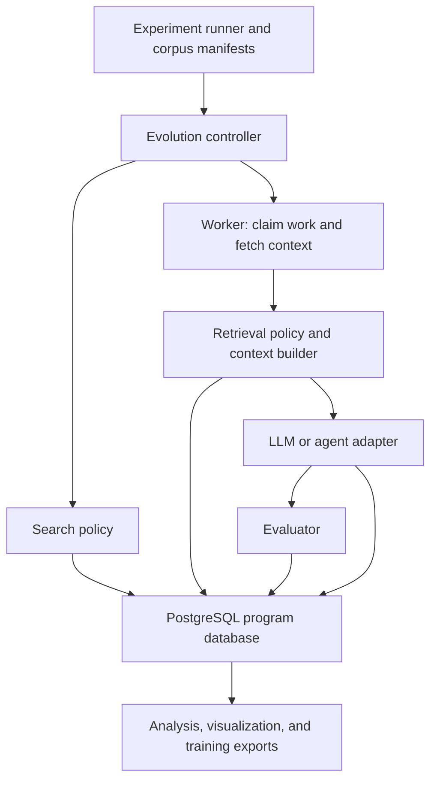

**Trellis in OpenEvolve: research and implementation design**

Prepared September 8, 2026 against checkout `411fb59`; revised September 9 to extract a program database interface first, retain the existing algorithm in an in-memory implementation, and then implement PostgreSQL. This is a new proposal derived from the Trellis paper, the current code, and the research questions in this conversation. It does not use the existing project plan as its specification. The working assumption is that the first deliverable is a research prototype with controlled experiments. This document describes the research roadmap. The interface extraction is the first development step; the PostgreSQL and Trellis research capabilities below remain proposed work.

**Objective.** Turn OpenEvolve into a reproducible testbed for agents that improve through accumulated, shared experience. Establish whether experience helps, whether graph structure contributes beyond flat retrieval, and whether discoveries transfer between independent searchers. Follow with training and systems experiments using the same operational data.

The first research milestone is a controlled comparison of no historical memory, prior winners, flat retrieval, and graph retrieval on held-out tasks. A database-backed evolution run is an intermediate implementation milestone.

**Architecture.** Separate four responsibilities: search policy chooses what to explore; retrieval policy chooses historical evidence; a worker generates and evaluates an attempt; an experience store owns durable records and current search state. An experiment runner configures these components and controls which historical data each run can see.

PostgreSQL is the program database from the outset. Each request for a parent, inspirations, an elite, or pending work executes a query over committed database state. The policy chooses the query and its parameters; reusable parameterized statements are sufficient. The DBMS performs selection, filtering, ordering, sampling, aggregation, and updates. Python retains the current candidate and the bounded context needed to execute it.

There are no application checkpoints in this execution model: no periodic population save, no deserialization on restart, and no authoritative Python map mirrored into SQL. Restart means connecting to the same database and querying the session and eligible work. Historical event reconstruction and immutable experiment corpora support analysis; they are not a prerequisite for continuing execution.



Use PostgreSQL for the first implementation. Add pgvector when building historical similarity retrieval and an artifact store when large content needs it. Start vector retrieval with exact search; measure approximate retrieval separately when scale requires it. pgvector supports both modes, with a recall/speed tradeoff for approximate indexes. [pgvector documentation](https://github.com/pgvector/pgvector#querying)

Implement lineage queries using bounded recursive SQL and typed links. PostgreSQL supports recursive queries over hierarchical data. This gives a concrete reference implementation before evaluating a specialized graph or hybrid-query backend. [PostgreSQL recursive queries](https://www.postgresql.org/docs/current/queries-with.html#QUERIES-WITH-RECURSIVE)

Keep the existing CLI and library task inputs, and replace their state-management path with PostgreSQL sessions. Preserve ordinary OpenEvolve at a pinned checkout as a separate experimental baseline. Worker requests carry work IDs and bounded context. The existing process pool can remain the local worker launcher. Remove checkpoint callbacks, checkpoint configuration, and population snapshot construction from the PostgreSQL execution path.

The existing in-memory operations become database operations:

| Current operation | PostgreSQL operation |
| --- | --- |
| `programs[id]` | Point query for a node and its evaluation/artifact. |
| Choose a parent | Query the eligible population with the policy's island, fitness, and sampling conditions. |
| Choose inspirations | Query ranked or diverse eligible nodes with explicit limits. |
| Read a MAP-Elites cell | Query the elite for a session, island, and feature-cell key. |
| Add a candidate | Insert the attempt/evaluation and transactionally update its search eligibility and cell ownership. |
| Enforce population size | Rank eligible members and update membership; retain historical attempts. |
| Migrate between islands | Query eligible migrants and update or insert the appropriate membership and provenance records. |
| Find the best result | Query valid evaluations using the task's fitness ordering. |
| Continue after restart | Query session progress, pending updates, and eligible work. |

A dictionary-shaped adapter that loads rows into a Python population does not satisfy this design. A query result can be materialized for the current prompt without becoming an authoritative population cache.

**Data model.** An attempt, a code artifact, an evaluation, and membership in a search population are different records. The same code may occur in several attempts, receive several evaluations, or participate in multiple islands. Code hashes deduplicate artifact bytes; they do not erase attempts.

| Record | Required content and purpose |
| --- | --- |
| Task | Specification, family and instance parameters, initial artifact, evaluator version, metric definitions and direction, correctness contract, environment manifest. |
| Session | Task, searcher/model configuration, search-policy version, seed, budgets, status, progress, experiment assignment, permitted corpus. Store configuration without credentials. |
| Node | Attempt ID allocated before generation, originating session, primary parent, lifecycle status, generated artifact reference when available, outcome references, generation, timestamps. Failures can have no code. |
| Additional links | Sources used as inspirations or seeds, alternate derivation links, and explicitly supported repair relationships. Preserve source node IDs across sessions. A retrieved reference records exposure, not proof that it caused an improvement. |
| LLM calls | Ordered messages and responses for each invocation and retry, requested and reported model, generation parameters, usage, latency, provider request ID when available, and terminal status. |
| Evaluations | Node and artifact, evaluator/environment versions, raw metrics, validity, fitness within that task's metric contract, diagnostics, duration, and retry/replicate identity. Re-evaluation appends evidence. |
| Artifacts | Content hash, media type, size, and durable location for code, diagnostics, traces, and other outputs. |
| Search state | Active membership, island membership, archive eligibility, cell elites, feature coordinates and mapping version, plus policy-specific counters. Eviction updates this state without deleting historical nodes. |
| Work and events | Work status, lease and claim generation, reserved budget, and ordered lifecycle/search-state changes. |
| Context selections | Retrieval query/version, corpus version, candidate IDs and scores, selected evidence, rendered excerpts, truncation, token counts, and the search-state values used for the decision. |
| Corpus and experiment manifests | Immutable permitted source IDs/revisions, task splits, experimental conditions, configuration hashes, and replicate identity. |

Use relational columns for frequently queried state and JSON for heterogeneous evidence. Every query that assembles context must respect the permitted corpus, including each node reached through graph expansion.

Score comparisons require a shared evaluation contract. A score from one task or hardware configuration cannot automatically become fitness in another task. Retrieved programs can supply reference context; programs inserted as starting candidates must be evaluated on the target task. Unknown correctness stays unknown.

Record mutable search-state changes with a per-session revision assigned under a short session write lock. Apply the state change and its event in the same transaction. Record the actual values used by each decision as well: submitted iteration numbers, completion order, and wall-clock timestamps are not interchangeable, and a sequence number alone does not establish concurrent commit order. This supports reconstructing observed decisions and later historical queries without using future statistics.

**Interfaces and code placement.** First extract `ProgramDatabase` in `openevolve/database.py`, shared `Program` values in `program.py`, and the existing policy in `database_memory.py`. The controller accepts an implementation via `database=` and workers receive bounded `IterationContext` values. The interface includes insertion, selection, ranked lookup, artifacts, prompts, and aggregate progress; it has no checkpoint operations. Add PostgreSQL behind that interface next. As experience capture grows, introduce the richer interfaces below with bounded reads and explicit transactions. Avoid a store API that returns the entire graph for callers to filter in Python.

| Proposed module | Responsibility |
| --- | --- |
| `openevolve/experience/records.py` | Task, node, call, evaluation, context, work, and event records. |
| `openevolve/experience/store.py` | ExperienceStore protocol: lifecycle, claims, graph reads, bounded selection, context, and result commits. |
| `openevolve/experience/postgres.py` and `sql/` | Schema, migrations, queries, and transaction implementations. |
| `openevolve/experience/artifacts.py` | Content-addressed local/shared artifact storage behind an interface that can later support object storage. |
| `openevolve/search/base.py`, `map_elites.py`, `greedy.py` | Versioned search policies. Start with MAP-Elites; add greedy for transfer experiments. |
| `openevolve/memory/retrieval.py` and `context.py` | Historical retrieval policies, evidence ranking, graph expansion, and prompt-budget allocation. |
| `openevolve/experiments/` | Task/corpus manifests, experiment execution, usage accounting, and analysis. |
| `openevolve/experience/export.py` | Versioned analysis and training exports with provenance. |

The store should expose operations such as `begin_attempt`, `claim_work`, `record_call`, `record_evaluation`, `commit_search_update`, `select_parent`, `select_local_inspirations`, `get_ancestors`, `get_siblings`, `retrieve_evidence`, and `get_session_progress`. Concrete signatures should use typed query objects and pagination where needed.

The search policy specifies selection strategy, fitness semantics, diversity rules, and proposed transitions. The store executes the corresponding bounded queries and commits transitions against current state. This keeps SQL out of the controller while allowing different search policies over the same records.

Derive independent random streams from the session seed and stable work identity, and define deterministic tie ordering. Record chosen parents and inspirations. Concurrency still changes which committed outcomes are available at selection time, so a reproducible experiment records the schedule and observed decision inputs rather than promising identical live trajectories from a seed alone.

The main existing integration points are:

- `controller.py`: connect to/create sessions, configure policies, enforce session budgets, query progress and the final result, and remove checkpoint orchestration.
- `process_parallel.py`: allocate attempts before work, replace population snapshots with work IDs, and persist intermediate boundaries instead of returning the only copy of evidence to the parent process.
- `database.py`: define the query contract shared by `database_memory.py` and a future PostgreSQL implementation. PostgreSQL owns its population state and selection; extract MAP-Elites policy parameters and separate active membership from history as the research model grows.
- `llm/base.py`, `llm/ensemble.py`, and provider adapters: expose structured call results and per-retry records. Preserve a text-returning compatibility wrapper for existing callers.
- `evaluator.py` and `evaluation_result.py`: retain stage outcomes, validity, diagnostics, and repeated measurements. Adapt existing evaluator return formats.
- `prompt/sampler.py`: accept an explicit historical-evidence bundle alongside current-session context, then retain the exact rendered messages.
- `evolution_trace.py` and `scripts/visualizer.py`: consume store queries/exports and display source evidence, failures, and cross-session links.

**Attempt lifecycle and recovery.** Commit a node/work reservation before invoking a model. A worker claims it with a lease, obtains bounded context, and persists the selected evidence and messages. Persist the raw model response before parsing it; persist the candidate artifact before evaluating it; persist evaluation evidence before applying population changes.

Represent lifecycle outcomes explicitly: queued, claimed, generating, generated, evaluating, evaluated, and failed/interrupted/cancelled. Invalid generation, failed correctness, timeout, and infrastructure failure remain distinct. Evaluation completion can be followed by a pending search update, so a restart can apply that update without re-running evaluation.

Claim work with a short transaction and row locking. PostgreSQL's `SKIP LOCKED` is suitable for queue consumers; use it for work claims rather than assuming it provides a consistent view for ranking the search frontier. [PostgreSQL locking documentation](https://www.postgresql.org/docs/current/sql-select.html#SQL-FOR-UPDATE-SHARE)

Never hold a database transaction open during LLM generation or evaluation. Renew leases during long work. Fence commits with a claim-generation token, make result commits idempotent, and recover expired work from the latest persisted boundary. Permit multiple distinct expansion jobs for the same parent when the search policy requests them.

A crash after a provider finishes but before its response is stored can still lose that response. Record the interrupted invocation and reconcile it only when the provider supports doing so; otherwise a retry is separate work with separate cost. The system guarantees retention of committed evidence, not exactly-once external computation.

Commit population changes, progress, consumed work, and associated events atomically. Reserve model/evaluation budget when scheduling concurrent jobs so parallelism cannot silently multiply the experimental allowance. Track permitted overshoot from already-running calls explicitly.

Recheck elite replacement and population limits against the state locked for commit; a worker's earlier view cannot unconditionally overwrite a newer winner. Begin with serialized, short session-state commits for straightforward correctness, then measure whether finer-grained concurrency is needed. Selection reads should be side-effect free: update feature statistics through explicit writes, and version any resulting behavior change relative to the legacy policy.

Publish artifact content before committing its database reference, verify its hash, and retain it for the lifetime of any experiment that references it. A shared worker demonstration requires shared artifact access as well as database access.

**Historical retrieval.** Keep current-session search context consistent across experimental conditions. Initially vary only access to prior experience:

| Policy | Historical context |
| --- | --- |
| `none` | No prior-session evidence. Still record the new run. |
| `winners` | Relevant successful artifacts with comparable evaluation metadata. |
| `flat` | Relevant individual attempts, including failures and diagnostics, without graph expansion. |
| `graph` | Relevant attempts expanded into bounded ancestors, siblings, and failure/repair evidence. |

Treat initialization from a prior winner as a separate experimental factor. Combining a better starting program with graph retrieval in only one condition would confound the result.

Apply corpus and compatibility filters, retrieve seeds from task descriptions and structured node diagnostics, expand allowed graph neighborhoods, then rank and deduplicate evidence under a prompt-token budget. Store embedding model/version and input hashes. OpenEvolve's existing code-embedding novelty check serves a different purpose and should remain a separately controlled feature.

Start with deterministic ranking, bounded depth, and explicit evidence quotas. Keep the same seed retrieval and token budget in flat-versus-graph comparisons. Add component ablations that remove links, failed attempts, or rewards while retaining other inputs. Include matched-node-content comparisons where feasible to distinguish benefits of relational presentation from benefits of finding different nodes.

Preserve parent/current code priority in prompt assembly. Record all truncation and actual message tokens. Empty retrieval is an observable outcome; do not fill the budget with arbitrary material. Add injection frequency, diversity-aware reranking, and stale-evidence handling as later versioned policies. An inferred repair relation must carry its inference method and evidence.

**Implementation sequence and completion checks.**

0. **Extract the program database interface.** Move the existing population and selection logic into `InMemoryProgramDatabase`. Route controller and evaluator access through bounded query methods and explicit writes. Pass only the selected context to workers. Remove checkpoint orchestration and population save/load from the in-memory implementation. Test the shared contract and run the controller through a facade exposing only interface methods. Completion: ordinary evolution works without direct map access outside the implementation; the in-memory version remains the development reference.

1. **Build the PostgreSQL program database.** Pin the current checkout as an external baseline. Define the minimal relational task/session/node/evaluation and active-search tables, including parent links, island membership, feature cells, fitness, and attempt status. Implement actual SQL operations for insertion, parent/inspiration selection, elite lookup/update, population enforcement, and best-result lookup. Use a real temporary PostgreSQL database and deterministic fixtures from the first tests. Completion: committed rows and query results alone determine the next selection; the PostgreSQL implementation does not reconstruct or mirror an authoritative Python population. Reuse the interface contract tests against a real database.

2. **Run evolution directly against PostgreSQL.** Inject the PostgreSQL implementation behind the extracted interface and exercise the SQL operations from step 1. Allocate attempts before generation and persist messages, responses, evaluations, and terminal statuses. Start with a single worker and scripted generation through the actual pipeline. Remove application checkpoint saving/loading from this path. Completion: every iteration obtains its parent and context through DBMS queries and commits its result; a newly constructed controller continues the session by querying PostgreSQL. Failed attempts and displaced ancestors remain queryable. A capture mirror under the existing Python map is not an intermediate deliverable.

3. **Add concurrent execution and research controls.** Introduce work leases, fenced/idempotent commits, budget reservations, and interruption tests against PostgreSQL. Version feature mappings and persist assigned cells; any change to existing scaling/sampling behavior becomes a separately named policy variant applied consistently across experiment arms. Add structured provider-usage reporting, task specifications, metric contracts, experiment manifests, and a parameterized sorting family with immutable discovery/development/test splits. Completion: competing workers do not duplicate committed results or corrupt elites, all state needed to continue is queryable, and rerunning a manifest produces auditable measurements without corpus leakage.

4. **Implement retrieval and run the first controlled study.** Add the four policies, corpus boundaries, token budgeting, retrieval provenance, and source-evidence visualization. Generate a small independent discovery corpus, freeze it, tune retrieval only on development tasks, and run held-out comparisons. Completion: a reproducible report compares conditions on validated quality, success, total tokens, elapsed time, repeated failures, and diversity. A measured lack of graph advantage is a valid research result.

5. **Test accumulation and collective reuse.** Build nested immutable corpus versions at several historical-compute budgets, then compare performance on fixed held-out tasks. Add greedy search and a second measurable model backend. Compare isolated, pooled-frozen-history, and live-shared-history runs at equal total compute. Add a second task family. Completion: experience-growth curves and transfer matrices identify where prior work helps, plateaus, or harms exploration.

6. **Close a training loop.** Export successful trajectories, matched-context preference pairs, and decision-time graph features with dataset manifests. Train a small generation model or frontier-value model through a separate training toolchain, evaluate on untouched tasks, and append another round of exploration. Completion: compare equal training budgets and evaluate with retrieval both enabled and disabled. Preference pairs require the same effective prompt and evaluation contract; sharing a parent alone is insufficient. Keep group-relative online training as a later extension requiring compatible rollout and policy metadata.

7. **Evaluate the data foundation as a system.** Replay the measured operational workload at larger scale: frontier selection, mixed graph/vector retrieval, concurrent commits, artifact access, and training extraction. Compare query composition strategies on equivalent outputs or measured retrieval recall. Add provenance-based invalidation of exports and scoped access across raw and derived data before making governance claims. Completion: report latency distributions, throughput, recovery waste, storage growth, and search impact under contention. A specialized query-engine adapter should be justified by these results.

Steps 1-4 form the first research release. Steps 5-7 establish broader claims without making them prerequisites for the initial result. Model training can begin after complete capture, decision provenance, and corpus isolation are reliable; it need not wait for specialized query execution.

**Benchmark design.** Parameterize existing examples rather than treating repeated runs of one fixed problem as evidence of generalization. Start with adaptive sorting over distinct input-distribution families and sizes. Extend to packing instances with different counts/constraints, or numerical optimization families with independently verified objectives. The current circle-packing evaluator is fixed to 26 circles, and the minimization example uses fixed reference values, so both require explicit task-family adapters before supporting these studies.

Separate discovery tasks that populate memory, development tasks that tune retrieval, and final evaluation tasks. Within each task, separate feedback tests visible during search from final validation tests. Verify outputs independently, including fitness values claimed by generated code. Run final validation under a fixed environment and preserve evaluator/test hashes. Validate artifact identity across generation and execution.

Use frozen corpus manifests for causal comparisons. Final evaluation outcomes cannot enter a corpus used by another nominally independent test run. For online accumulation experiments, define chronological cohorts and sharing groups explicitly; each decision records exactly which revisions were visible. Split at the problem-family or generator level when simple instance splits would leak near-duplicates.

Match model settings, current-session policy, initial program, task, evaluation allowance, and completion-token limits across memory conditions. Cap added context uniformly, and report total input/output tokens instead of assuming identical context length. Include retrieval, embedding, summarization, failed calls, retries, compilation, and evaluation costs. Distinguish provider-reported usage from estimates and unavailable values; unavailable cost must never be silently treated as zero.

The current text-only provider adapters do not expose enough data for these measurements. Begin published cost comparisons with backends that expose usage reliably. A CLI or agent backend needs an adapter for the structured events it actually exposes; record missing internal tool/model spans explicitly rather than claiming a complete transcript.

Use a small pilot to estimate variance and choose replication counts. Analyze independent tasks, sessions, and corpus replicates as experimental units; nodes within a session are correlated. Report uncertainty, every failed run, and the fraction that never reaches the target. Do not average only successful runs. Normalize comparisons within each task before aggregating across domains.

The first release should generate these artifacts from its manifest:

- Fitness versus total tokens and elapsed time, with independent final validation.
- Target-reaching success and cost, including runs that exhaust their budget.
- A comparison of historical-memory policies and component ablations.
- Corpus growth versus marginal new-task benefit and amortized cost.
- A lineage/evidence view that explains selected concrete successes and failures without replacing aggregate measurements.

Collect a database workload trace from the outset: query class, latency, rows/bytes returned, history size, active population size, and concurrent workers. This makes later systems experiments representative of the agent workload.

**Configuration and user workflow.** Add explicit database/session, retrieval, search-policy, and experiment configuration. Continue a run by session ID. Original OpenEvolve runs remain available in the pinned baseline checkout. The exact spelling below is illustrative:

```yaml
experience:
  backend: postgres
  dsn_env: OPENEVOLVE_EXPERIENCE_DSN
  artifact_root: ./experience_artifacts
search:
  policy: map_elites_v1
retrieval:
  policy: graph
  corpus: sorting_discovery_v1
  max_context_tokens: 3000
  max_graph_depth: 3
experiment:
  manifest: sorting_graph_ablation_v1
```

Provide commands or library functions to register tasks, run/resume a session, freeze a corpus, execute an experiment manifest, inspect node evidence, and export results. Experimental conditions should differ through these policies and manifests rather than separate controller forks. Keep PostgreSQL dependencies in an optional package extra and provide a reproducible local database setup for contributors.

**Verification.** Test the PostgreSQL query contract, graph traversal and corpus boundaries, prompt reconstruction, retry accounting, population invariants, and concurrent claims against a real database. Inject failures at transaction boundaries. Check that failures retain a node even without generated code, inactive ancestors remain accessible, target-task fitness is re-evaluated, and graph expansion cannot import held-out records. Construct a fresh controller after committed changes and verify its next selection reflects those rows without loading a checkpoint. Inspect query results and memory use to ensure no authoritative Python population is reconstructed. Controlled single-worker tests can compare normalized deterministic decisions; randomized and concurrent search needs invariants and distributional checks rather than an identical trajectory requirement.

Adapt tests that directly manipulate `database.programs`, `islands`, or cell maps to verify public behavior on the new path. Retain the pinned legacy baseline independently. Do not use the existing smoke assertion that at least one program survives as proof of meaningful search improvement.

**Initial scope choices.** Extract the interface and an in-memory implementation first, then add PostgreSQL queries using one local worker launcher and MAP-Elites. Neither implementation needs application checkpoints. The PostgreSQL backend owns its rows and selection policy directly; the in-memory implementation serves as a reference and test backend. Add another search policy to answer a transfer question. Preserve event and evidence provenance early because missing history cannot be recovered later. Expand into distributed services, additional storage engines, learned retrieval, training infrastructure, and fine-grained governance when the associated experiment requires them.

The architecture and scientific motivation follow the experience-graph, reuse, training, and research-agenda discussions in [trellis.pdf](trellis.pdf), particularly sections 4-7. PostgreSQL results would establish a reproducible implementation of the logical architecture; claims about a particular Trellis optimizer or physical design require a corresponding implementation and controlled systems comparison.
